---
## Front matter
lang: ru-RU
title: Отчет по лабораторной работе №1
subtitle: Операционные системы
author:
  - Курушин Георгий Романович.
institute:
  - Российский университет дружбы народов, Москва, Россия

## i18n babel
babel-lang: russian
babel-otherlangs: english

## Formatting pdf
toc: false
toc-title: Содержание
slide_level: 2
aspectratio: 169
section-titles: true
theme: metropolis
header-includes:
 - \metroset{progressbar=frametitle,sectionpage=progressbar,numbering=fraction}
---

# Информация

## Докладчик

:::::::::::::: {.columns align=center}
::: {.column width="70%"}

  * Курушин Георгий Романович
  * НКАбд-02-2024 № Студенческого билета: 1132246755
  * Российский университет дружбы народов
  * <https://github.com/GRKurushin/study_2024-2025_os-intro>

:::
::: {.column width="30%"}

:::
::::::::::::::

## Цели работы

Целью данной работы является приобретение практических навыков установки операционной системы на виртуальную машину, настройки минимально необходимых для дальнейшей работы сервисов.

## Задачи

1) Запуск VirtualBox и создание новой виртуальной машины (операционная система Linux, Fedora).
2) Настройка установки ОС.
3) Перезапуск виртуальной машины и установка драйверов для VirtualBox.
4) Подключение образа диска дополнений гостевой ОС.
5) Установка необходимого ПО для создания документации.
6) Выполнение домашнего задания.

## Теоретическое введение

Операционная система - это комплекс взаимосвязанных программ, который действует как интерфейс между приложениями и пользователями с одной стороны и аппаратурой компьютера с другой стороны. VirtualBox - это специальное средство для виртуализации, позволяющее запускать операционную систему внтури другой. С помощью VirtualBox мы можем также настраивать сеть, обмениваться файлами и делать многое другое.

## Выполнение лабораторной работы

## Создание виртуальной машины

1. Создадим новую виртуальную машину, указав имя, размер основной памяти, размер видеопамяти, размер диска и других параметров на свое усмотрение, выбираем образ системы Fedora. 

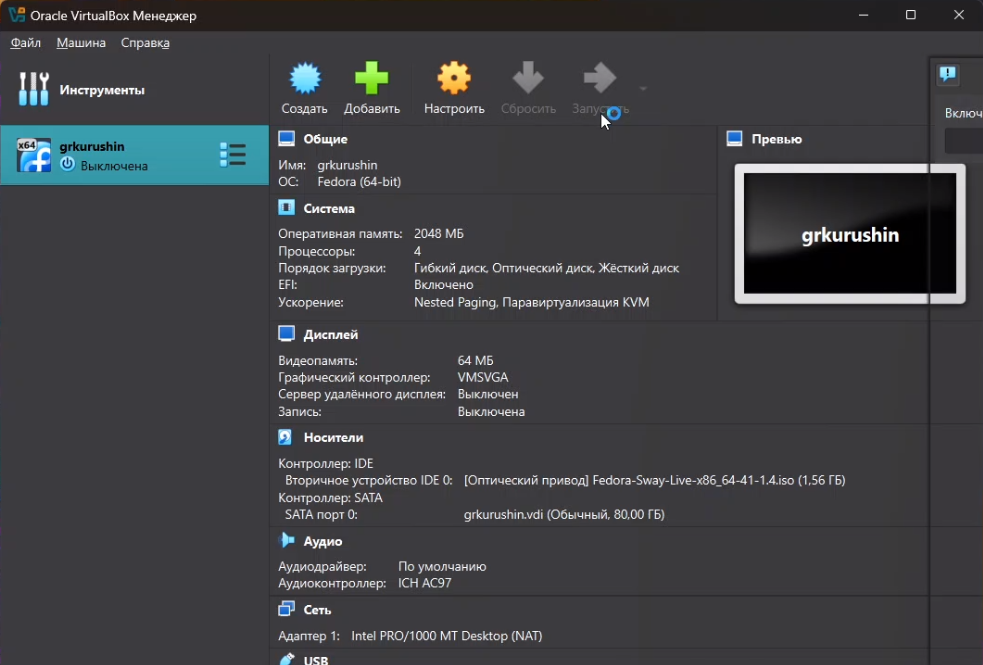{#fig:001 width=50%}

##

2. Начнем установку операционной системы, внеся перед этим необходимые для этого данные. 

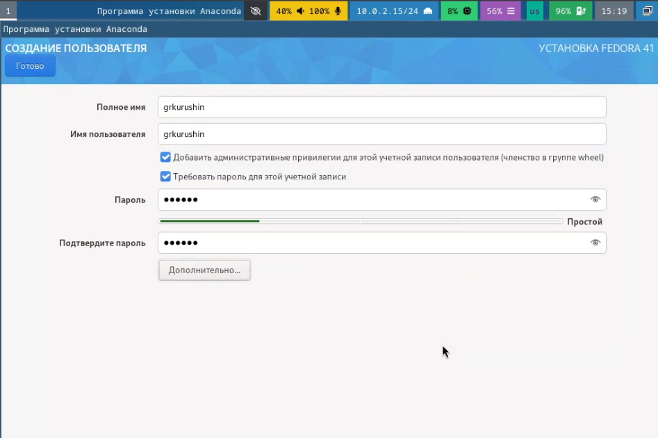{#fig:002 width=50%}

## После установки. Обновления

3. Войдем в ОС под своей учетной записью. В терминале через роль суперпользователя производим установку обновлений. 

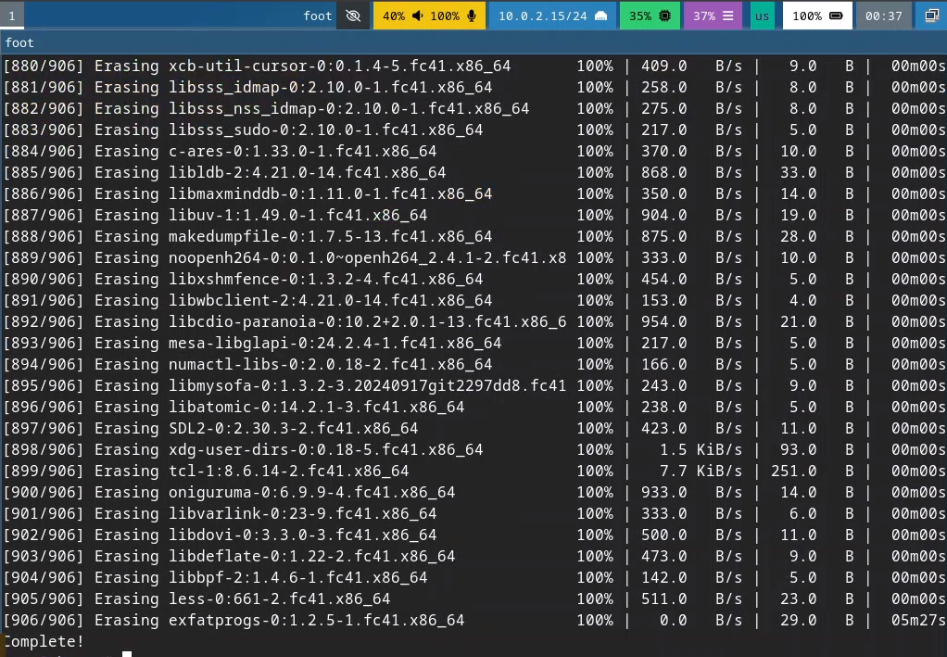{#fig:003 width=50%}

## Повышение удобства работы. Отключение SELinux

4. Установим программу tmux. Запустим ее, затем через команду mc в терминале заходим в требуемый файл и отключаем SELinux, заменив в файле значение enforcing на permissive. Перезапустим виртуальную машину.

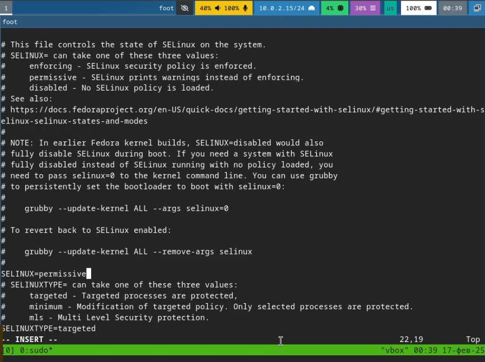{#fig:004 width=45%}

## Настройка раскладки клавиатуры

5. Создадим конфиг файл.

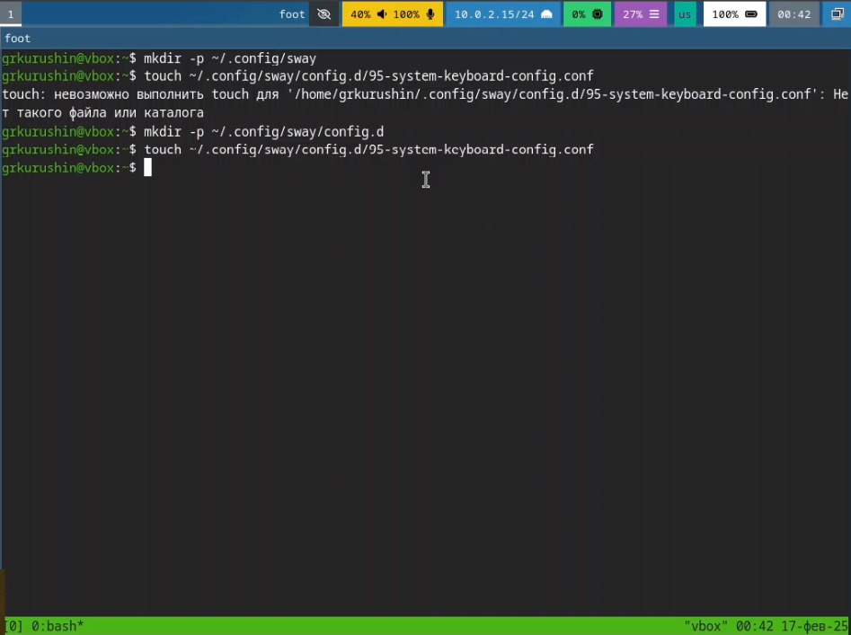{#fig:005 width=50%}

##

6. Отредактируем этот файл, подбирая значения под себя. Затем отредактируем еще один файл (/etc/X11/xorg.conf.d/00keyboard.conf) и перезагрузим машину.

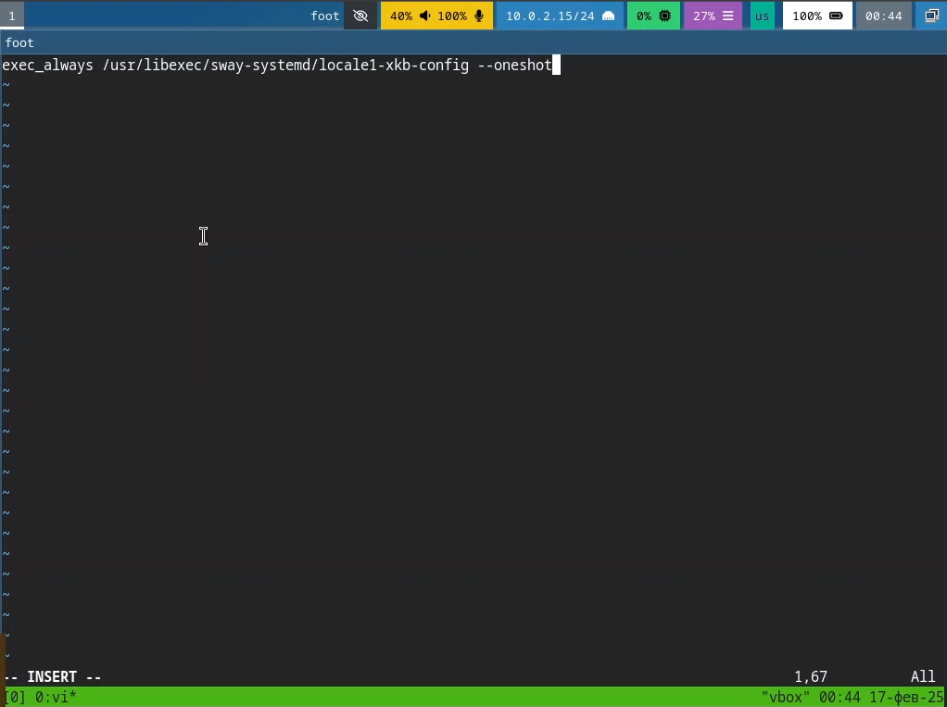{#fig:006 width=50%}

##

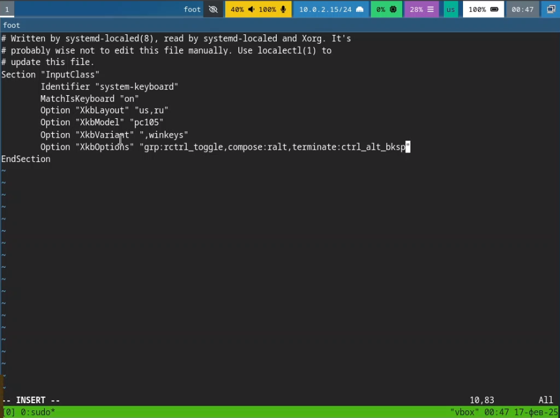{#fig:007 width=50%}

## Автоматическое обновление.

7. Устанавливаем ПО для автообновления. Снова редактируем конфигурационный файл, запускаем таймер.

## Установка программного обеспечения для создания документации

8. Скачаем pandoc и pandoc-crossref из репозитория Гитхаб. 

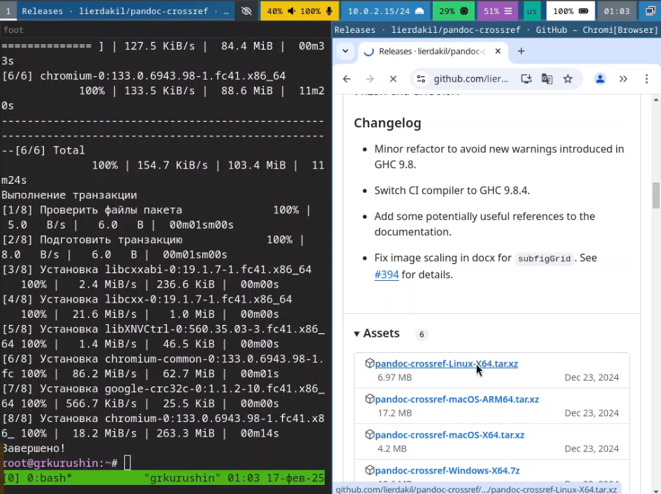{#fig:008 width=50%}

##

9. Перенесем необходимые файлы в необходимый каталог. 

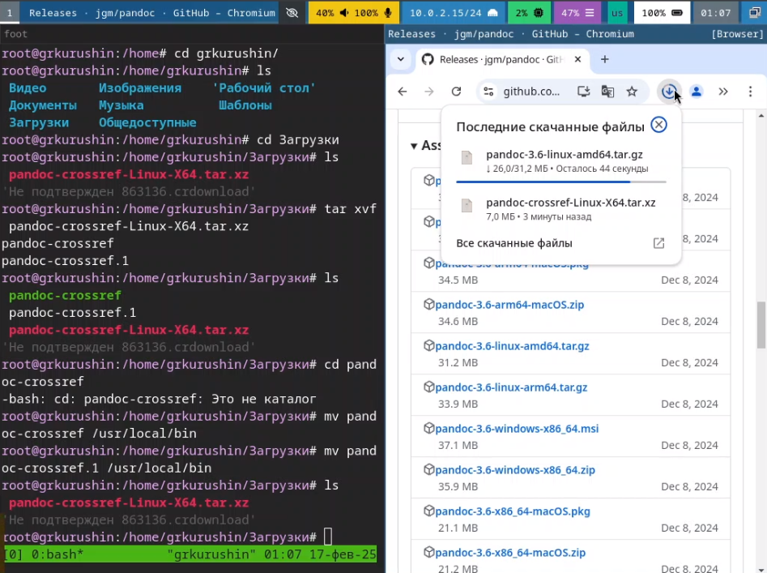{#fig:009 width=50%}

##

10. Установим дистрибутив TexLive. 

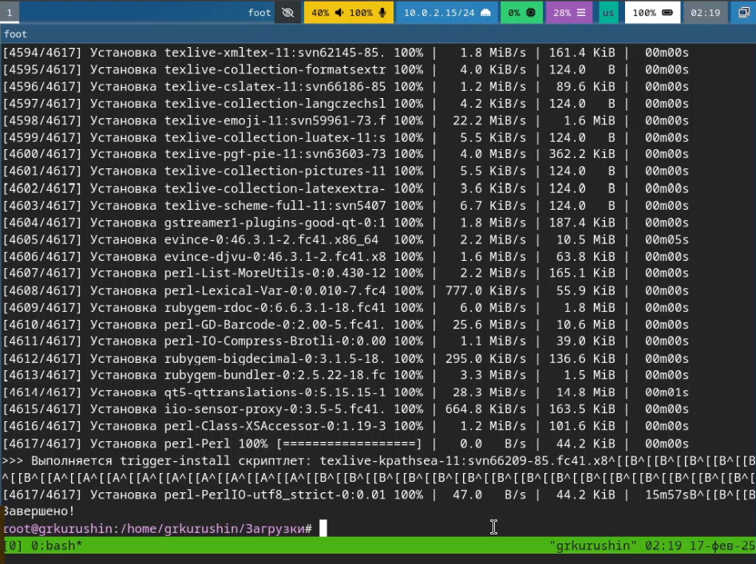{#fig:010 width=50%}

## Домашнее задание

11. Посмотрим порядок загрузки системы с помощью команды dmesg, получим необходимую информацию. 

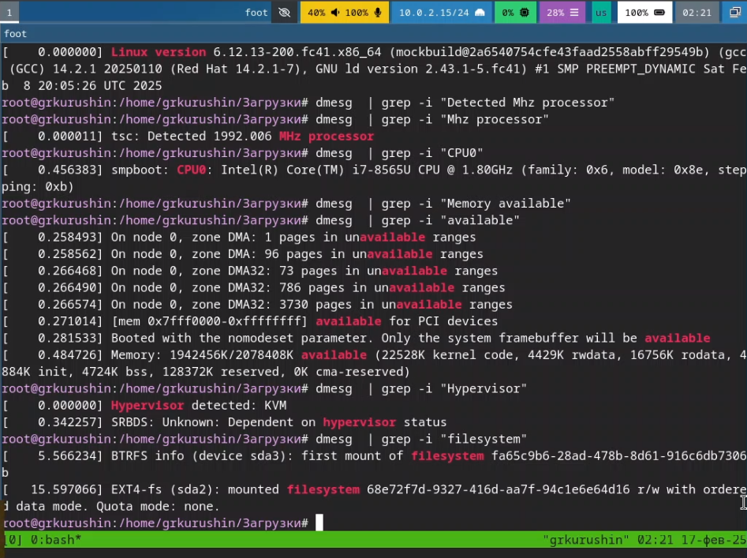{#fig:011 width=50%}

##

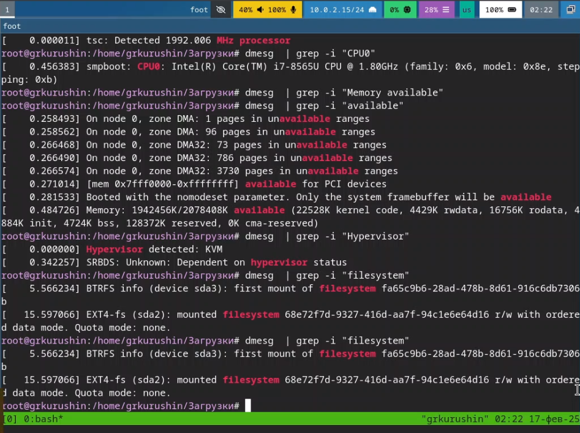{#fig:012 width=50%}

## Литература

1. Кулябов Д. С. Введерние в операционную систему UNIX - Лекция.
2. Таненбаум Э., Бос Х. Современные операционные системы. - 4-е изд. -СПб. : Питер, 2015. - 1120 с.

## Вывод

В результате выполнения лабораторной работы были приобретены навыки установки операционной системы на виртуальную машину, а также настройки минимально необходимых для дальнейшей работы сервисов.
:::
