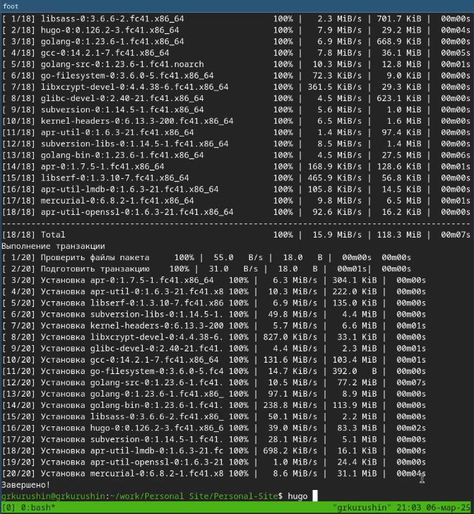
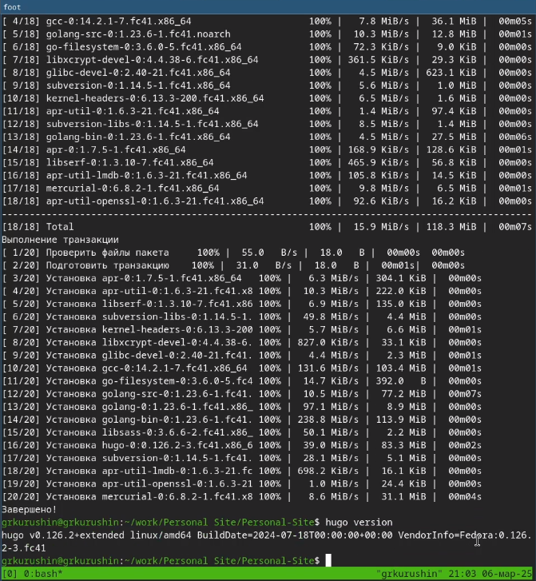
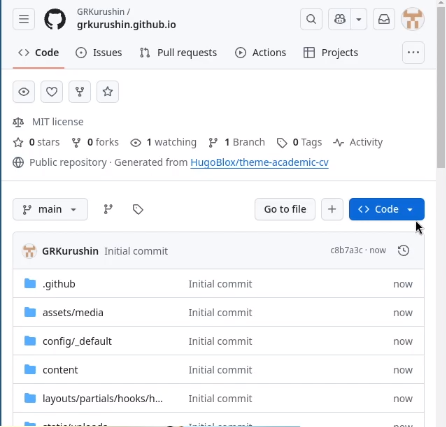
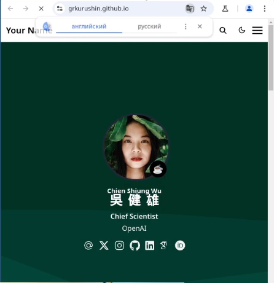
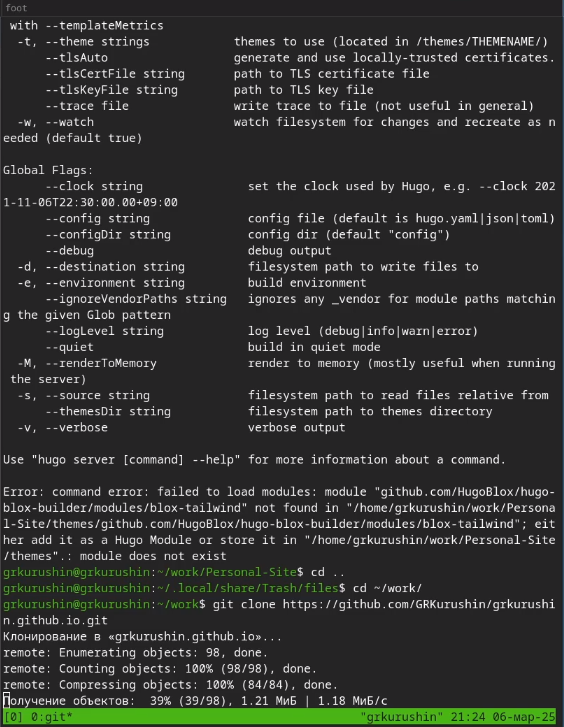
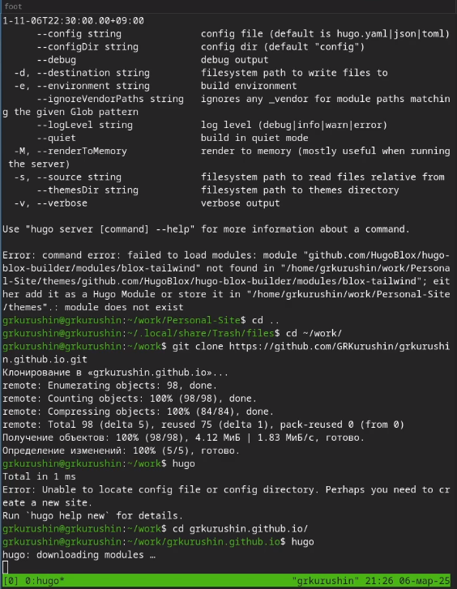
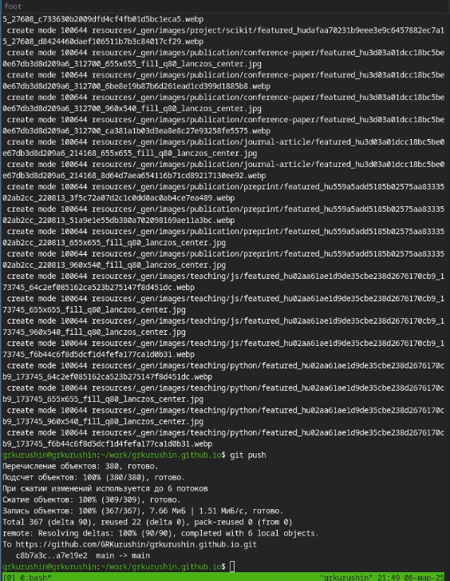

---
## Front matter
lang: ru-RU
title: Отчет по лабораторной работе №1
subtitle: Операционные системы
author:
  - Курушин Георгий Романович.
institute:
  - Российский университет дружбы народов, Москва, Россия

## i18n babel
babel-lang: russian
babel-otherlangs: english

## Formatting pdf
toc: false
toc-title: Содержание
slide_level: 2
aspectratio: 169
section-titles: true
theme: metropolis
header-includes:
 - \metroset{progressbar=frametitle,sectionpage=progressbar,numbering=fraction}
---

# Информация

## Докладчик

:::::::::::::: {.columns align=center}
::: {.column width="70%"}

  * Курушин Георгий Романович
  * НКАбд-02-2024 № Студенческого билета: 1132246755
  * Российский университет дружбы народов
  * <https://github.com/GRKurushin/study_2024-2025_os-intro>

:::
::: {.column width="30%"}

:::
::::::::::::::

## Цель работы

Размещение на Github pages заготовки для персонального сайта.

## Задание

1. Установить необходимое программное обеспечение.
2. Скачать шаблон темы сайта.
3. Разместить его на хостинге git.
4. Установить параметр для URLs сайта.
5. Разместить заготовку сайта на Github pages.

## Выполнение персонального проекта

1. Установим hugo

{#fig:001 width=40%}

## Выполнение персонального проекта

2. Проверяем корректность установки, узнав версию hugo

{#fig:002 width=40%}

## Выполнение персонального проекта

3. Клонируем репозиторий с темой theme-academic-cv в новый репозиторий grkurushin.github.io

{#fig:003 width=40%}

## Выполнение персонального проекта

4. Заходим в настройки репозитория, переходим во вкладку Pages и открываем наш сайт

{#fig:004 width=40%}

## Выполнение персонального проекта

5. Клонируем свой репозиторий на компьютер

{#fig:005 width=40%}

## Выполнение персонального проекта

6. Запускаем локальный сервер hugo, чтобы вносить изменения в live-режиме

{#fig:006 width=40%}

##  Выполнение персонального проекта

7. Пушим изменения в github

{#fig:007 width=40%}

## Выводы

Разместил на Github Pages заготовки для персонального сайта.

:::

